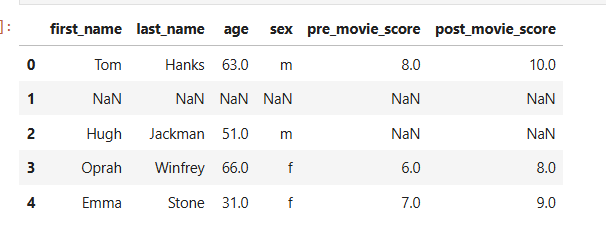

# dataScience-Lec8-26-MAR-25
Missing DATA- presentation 21- page 19
* filling data or delete data
* **number of columns=number of nan+number of available**
* parm=np.nan= like in python none
  * correct: print(parm is np.nan)#true
  * not correct: print (parm==np.nan)#false
* df with NaN:
 
* isnull()/isna(<value>): return for each value , if is value=np.Nan
  * always better use isna()
  * df.isnull()-/df[pre_movie_score].isnull() 
  * df[df[pre_movie_score].isnull()]= return all rows with null
  * works on df,series, not on value
      * value is np.Nan #not always works
      * pd.isna(value)
      * nan of pd is not always the same as the np.nan 
### delete data
* notna()~isna()= return all **not** null 
  * df[~df[pre_movie_score].isnull()]=df[df[pre_movie_score].notna()]
* dropna(thresh=number,axis,subset)- will remove all rows contain Nan.
  * thresh= optional parameter - at least **number** of nan in the *row*, the row will stay, including
    * will focus on the given group= row
    * number can be result of calculation
    * if want 1 of available value= thresh=len(df.column)-1)
  * dropna(axis=1)= will drop all columns with nan
    * dropna(thresh=4,axis=1)- will keep where 4 or more are available values **in the column**
    * dropna(subset=['age','sex']) = optional to focus only on columns, if in these columns have nan, then drop the rows
      * dropna(subset=['age','sex','pre_movie_score'], thresh=2)-then the thresh value will focus on these columns only
      if there are at least 2 nan: (in age=nan && sex=nan) or (age=nan && pre_movie_score=nan) or (sex=nan &pre_movie_score=nan)
